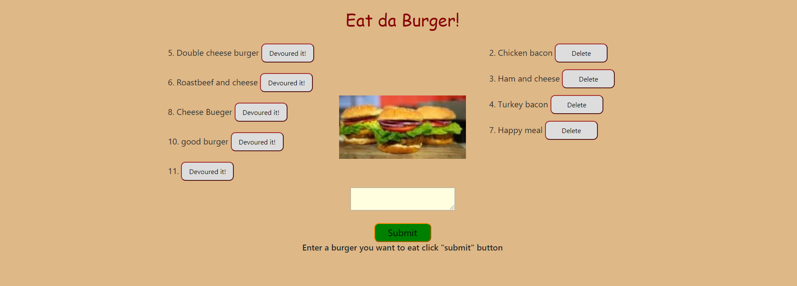

### <h1> _Eat-da-Burger!!_

### Overview:

#### Eat-Da-Burger! is a restaurant app that lets users input the names of burgers they'd like to eat. It is a full stack web application.

### Screenshot:

# 

### Code:

- When you add burger this handlebar code display burger with id and devoured button on the browser.

      {{#each burgers}}
      {{#unless this.devoured}}
      

        

          {{this.id}}. {{this.burger_name}}
          <button data-id="{{this.id}}" devoured="{{this.devoured}}" class="devoured" id="condition">
            Devoured it!
          </button>
        

### Installation:

**NPM install :**

- Express
- Express-handlebars
- Router
- MySQL

 run with : node server.js

### Hosting on Heroku :

## [Eat-da-burger](https://glacial-harbor-13375.herokuapp.com/)
